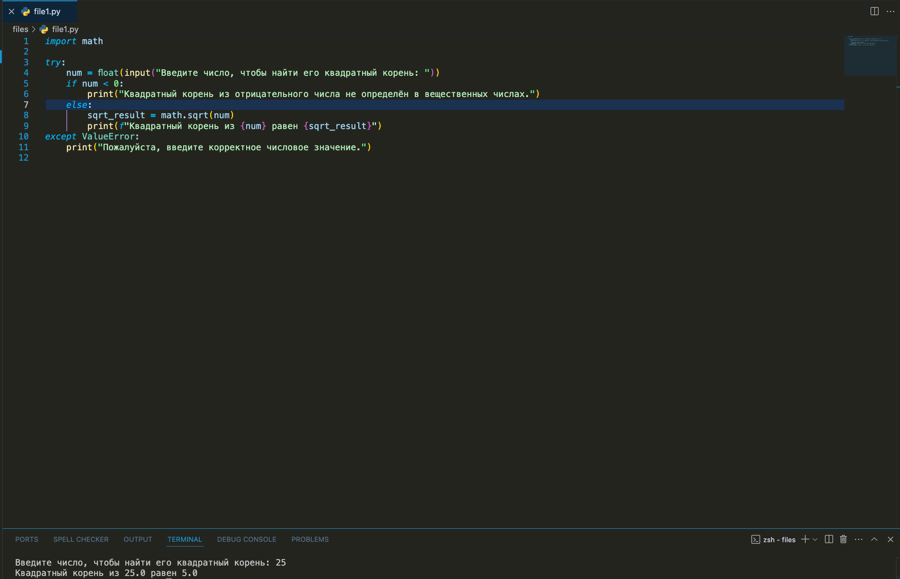
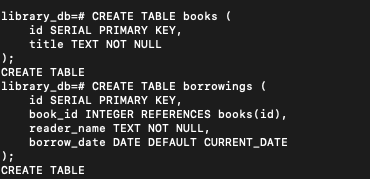
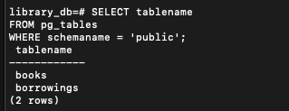
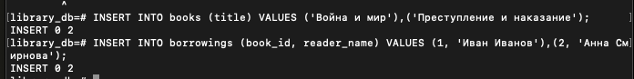
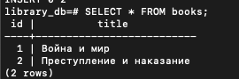
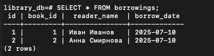
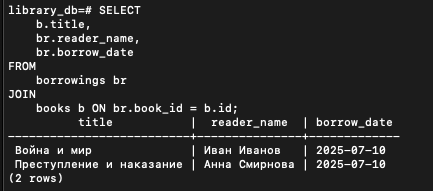
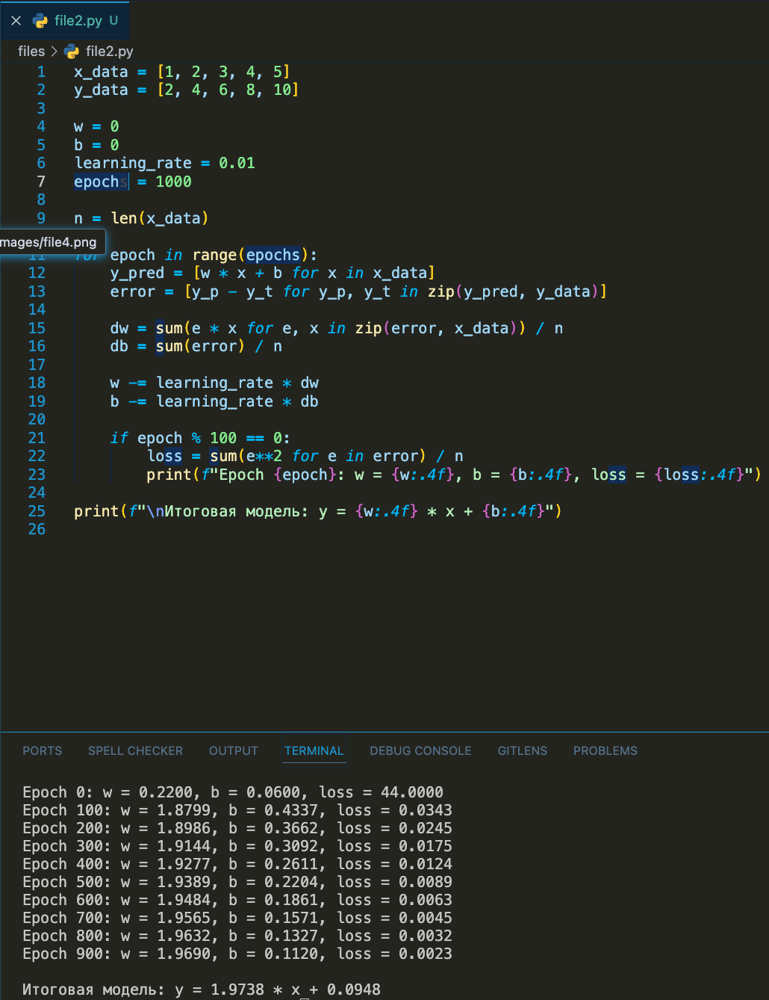
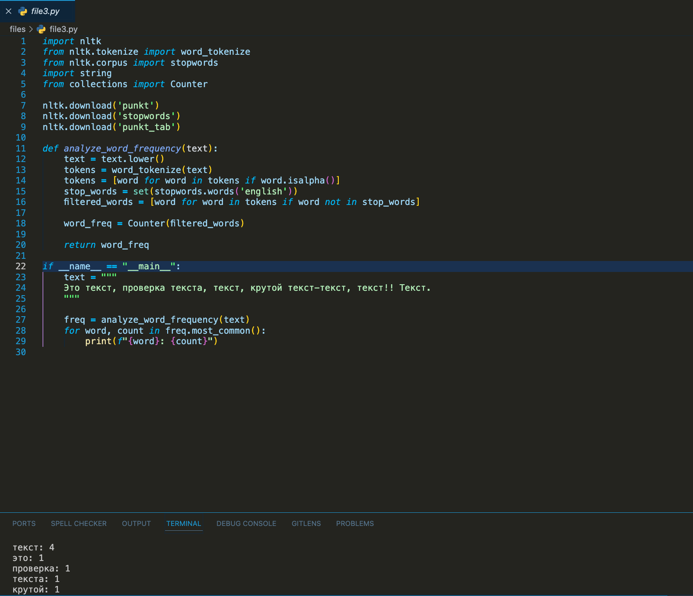
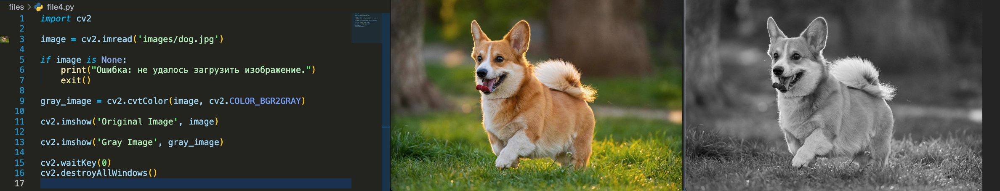

# Создать программу, которая использует библиотеку math для вычисления квадратных корней числа

Файл - file1.py

# Создать простую реляционную базу данных и описать ее схему
Cхема базы данных "Библиотека"

books: содержит список книг с уникальным ID и названием.

borrowings: фиксирует, какую книгу (book_id) взял читатель (reader_name) и когда

# Написать SQL запросы для выборки данных из таблицы
Добавим данные 

Напишем базовые запросы
1) Получим все книги

2) Получим все выдачи

3) Получить все книги с указанием, кто и когда их взял

# Описать алгоритм линейной регрессии и реализовать его на Python

Файл - file2.py

Описание алгоритма градиентного спуска
1) Инициализировать w и b (например, нулями).
2) На каждой итерации:
    a)Посчитать предсказания y_pred = w * x + b
    b)Вычислить ошибку: error = y_pred - y_true
    c)Вычислить градиенты
    d)Обновить параметры
3) Повторить до сходимости (например, 1000 итераций)

# Написать программу, которая анализирует текст и определяет частоту слов 

Файл - file3.py

# Использовать библиотеку OpenCV для обработки и отображения изображений

Файл - file4.py

